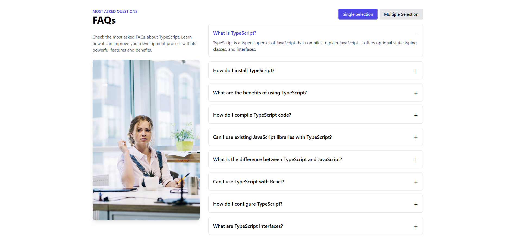

# FAQ Widget

This project is a modern FAQ widget built using React, TypeScript and Tailwind CSS. It features a 
responsive design with the ability to toggle between single and multiple question selection modes. 
The FAQ section provides a clean and interactive way to display frequently asked questions.

## Features

- Responsive design
- Toggle between single and multiple question selection modes
- Smooth transitions for opening and closing FAQ items
- Built with React, TypeScript and Tailwind CSS

## Screenshot



## Installation

To get started with the project, clone the repository and install the necessary dependencies.


### Clone the Repository

```bash
git clone https://github.com/samiwazni/FAQ_TypeScript_ReactJS.git
cd faq-typescript-react
```

## Install the necessary dependencies
npm install